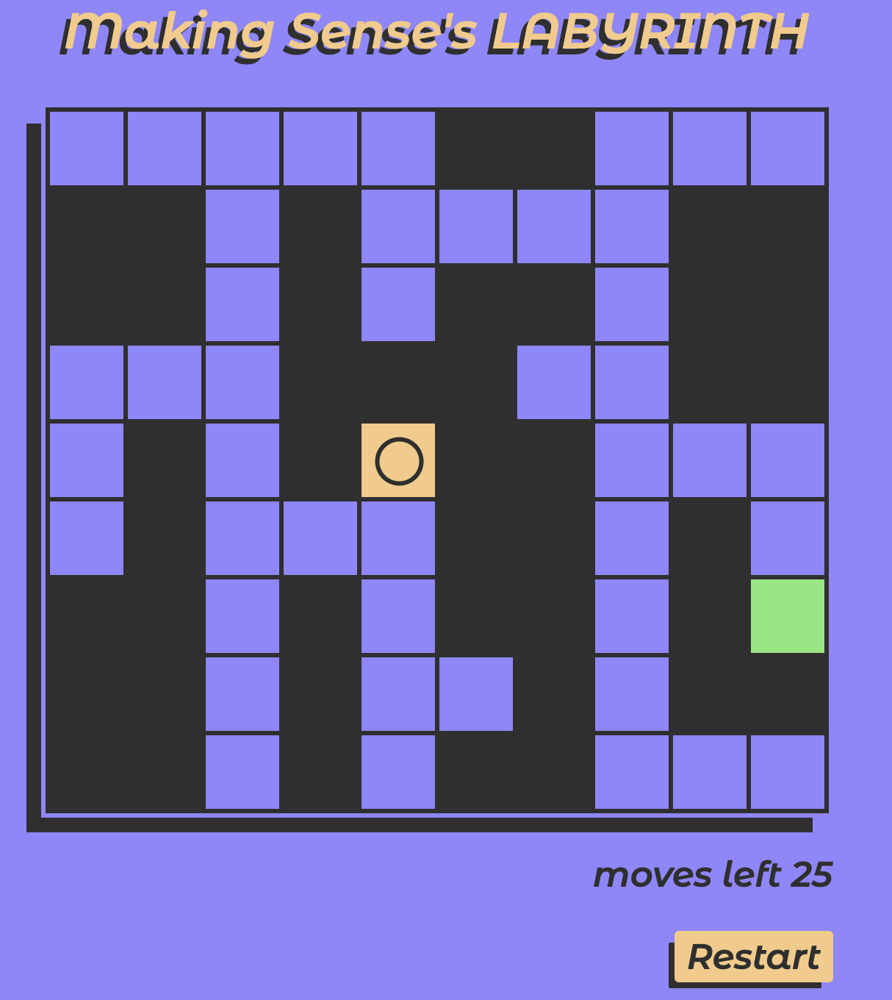
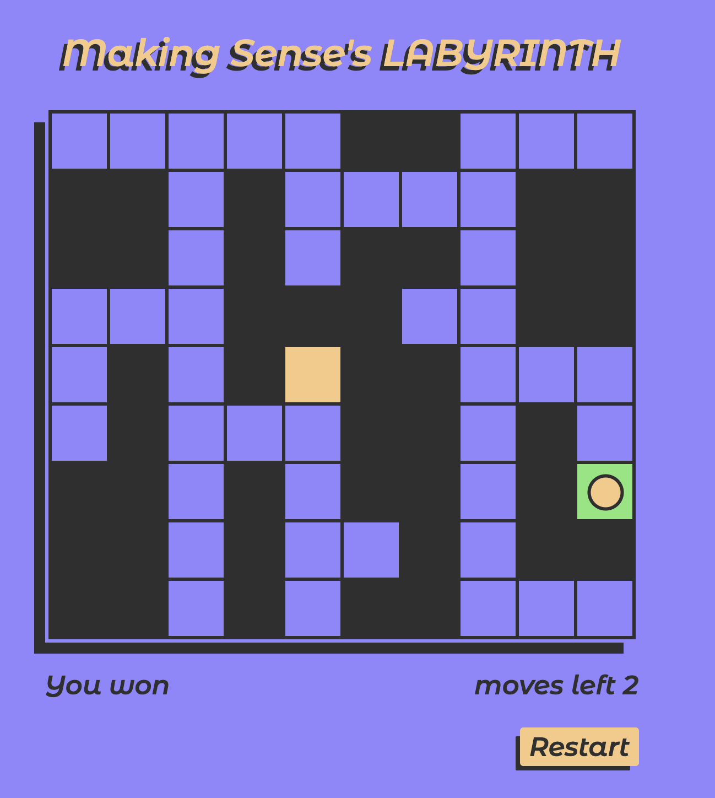

# Making Sense Labyrinth technical challenge

## The solution
Some comments about my solution to the challenge:
* The tests have been very slightly changed to adjust to the way I handle keydown events. No new tests have been added.
* The Styling and Restart nice to have features have been implemented.
* No target devices where assumed, so (taking into account that movement happens with arrows), Desktop was assumed as the intented target. Thus, no special adjustements have been made to support mobile devices. No target browsers were specified either, so modern browsers were assumed as the target, and thus modern CSS constructs such as CSS Variables are used (still, this has 95.29% global support as of October 2020).
* Every variable declaration has been made on the smallest scope possible, that is, everything is declared on the same file of the component it´s used in. Only when something is used on more than one place I've hoisted it to a higher level in the file hierarchy. This is the case of some shared types, which I've put in the `src/solution/types.ts`.
* Cell and border sized can be customized, both some minimal values are enforced (16px for cell size and 0px for borders). If values inferior to those are provided, they will be ignored and default to the afforementioned values.
* The same applies to component props; for example, in the `Labyrinth` component there are two variables `title` and `borderWidth` which are declared as constants, since I did not think it was neccessary to pass them as props from the top-level app. If it was desired to customize these, they could just be turned into props.
* No other parts of the provided app has been customized or changed.

## Screenshots
>   
>   
>   